<!-- Output copied to clipboard! -->

<!-----

You have some errors, warnings, or alerts. If you are using reckless mode, turn it off to see inline alerts.
* ERRORs: 0
* WARNINGs: 0
* ALERTS: 36

Conversion time: 3.434 seconds.

Using this HTML file:

1. Paste this output into your source file.
2. See the notes and action items below regarding this conversion run.
3. Check the rendered output (headings, lists, code blocks, tables) for proper
   formatting and use a linkchecker before you publish this page.

Conversion notes:

* Docs to Markdown version 1.0β33
* Mon Jul 25 2022 13:01:39 GMT-0700 (PDT)
* Source doc: Applying to (STEM) PhD Programs from Undergrad
* This document has images: check for >>>>>  gd2md-html alert:  inline image link in generated source and store images to your server. NOTE: Images in exported zip file from Google Docs may not appear in  the same order as they do in your doc. Please check the images!

WARNING:
You have 12 H1 headings. You may want to use the "H1 -> H2" option to demote all headings by one level.

----->

>>>>>  gd2md-html alert:  ERRORs: 0; WARNINGs: 1; ALERTS: 36.

<ul style="color: red; font-weight: bold"><li>See top comment block for details on ERRORs and WARNINGs. <li>In the converted Markdown or HTML, search for inline alerts that start with >>>>>  gd2md-html alert:  for specific instances that need correction.</ul>

Links to alert messages:
<a href="#gdcalert1">alert1</a>
<a href="#gdcalert2">alert2</a>
<a href="#gdcalert3">alert3</a>
<a href="#gdcalert4">alert4</a>
<a href="#gdcalert5">alert5</a>
<a href="#gdcalert6">alert6</a>
<a href="#gdcalert7">alert7</a>
<a href="#gdcalert8">alert8</a>
<a href="#gdcalert9">alert9</a>
<a href="#gdcalert10">alert10</a>
<a href="#gdcalert11">alert11</a>
<a href="#gdcalert12">alert12</a>
<a href="#gdcalert13">alert13</a>
<a href="#gdcalert14">alert14</a>
<a href="#gdcalert15">alert15</a>
<a href="#gdcalert16">alert16</a>
<a href="#gdcalert17">alert17</a>
<a href="#gdcalert18">alert18</a>
<a href="#gdcalert19">alert19</a>
<a href="#gdcalert20">alert20</a>
<a href="#gdcalert21">alert21</a>
<a href="#gdcalert22">alert22</a>
<a href="#gdcalert23">alert23</a>
<a href="#gdcalert24">alert24</a>
<a href="#gdcalert25">alert25</a>
<a href="#gdcalert26">alert26</a>
<a href="#gdcalert27">alert27</a>
<a href="#gdcalert28">alert28</a>
<a href="#gdcalert29">alert29</a>
<a href="#gdcalert30">alert30</a>
<a href="#gdcalert31">alert31</a>
<a href="#gdcalert32">alert32</a>
<a href="#gdcalert33">alert33</a>
<a href="#gdcalert34">alert34</a>
<a href="#gdcalert35">alert35</a>
<a href="#gdcalert36">alert36</a>

>>>>> PLEASE check and correct alert issues and delete this message and the inline alerts.

<h1>Applying to (STEM) PhD Programs from Undergrad</h1>

Eric Gagliano

<h1>Introduction</h1>

<h2>What is this Document?</h2>

Congratulations on considering grad school! Applying for grad school is weird: the process isn’t very transparent, and there seems to be a “secret code” that acts as a barrier to entry to most people unfamiliar with the process. <strong>This guide is meant to document my experience in applying and pass down the insight I was lucky enough to be given.</strong> This guide IS NOT representative of everyone’s experience or every program out there, but hopefully this will equip you with some of the knowledge you need to become a successful applicant. There isn’t a “right” way to do this--this was just how I did it. Don’t only use this guide, there are plenty of other resources out there! This guide is a compilation of advice I’ve received, and is only meant to supplement other knowledge already out there. The only reason I’ve made it this far is because I’ve had wonderful mentors and supporters who have guided me along the way. In truth, I owe all my success to them.

<h2>How to Reach Me</h2>

Feel free to reach out whenever you need. If you don’t already have my contact info…

Name: Eric Gagliano

Phone: 281-914-7744

Email: <a href="mailto:elgagliano@gmail.com">elgagliano@gmail.com</a>

Website: ericgagliano.com

Twitter: @EricGagliano

Address: 437 NE 72nd St E426 Seattle, WA 98115

<h2>The Undergrad Disadvantage</h2>

From what I’ve seen so far, it looks like most applicants to PhD programs already have a masters in a related subject and/or have work experience in the field they are applying to. In a lot of ways, this might put you at a disadvantage compared to other applicants. A program or professor may be more inclined to select a student that has “proved” themselves capable in some way, whether that means having already written papers or perhaps already being familiar with the concepts and software used in their respective field. That’s ok--it’s still possible to succeed! Especially if you are preparing earlier in your undergrad career, you can focus on acquiring valuable and relevant experience and knowledge.

<h2>Preliminary FAQ</h2>

<h3>Is a PhD for me? / Just Because You Can Doesn’t Mean You Should</h3>

I don’t know! You’re probably the person most well qualified to answer that question. From what I’ve been told, a PhD is for someone who:

<ul>

<li>Very interested in/passionate about a narrow field of study

<li>Willing to work independently

<li>Ok living frugally for 5+ years 

<li>Self-motivated
</li>
</ul>

And is not for someone who:

<ul>

<li>Wants to make more money

<li>Wants to be called “Dr.”

<li>Expecting more of undergrad style education
</li>
</ul>

Also, not to be discouraging in any way, but it may seem tempting to pursue graduate school as a back-up plan. Perhaps you can’t find a job right out of college, or you want to do some more learning. That’s ok! Explore your options, but remember that a PhD is a huge time commitment and the decision to pursue one shouldn’t be taken lightly. 

	

<h3>Do I Have to Pay for my PhD? / What is Funding?</h3>

	Unlike most bachelors and masters programs where you have to pay your way through school, for STEM PhDs, you will just about always be funded. This means that you will not have to pay your own tuition and you will be given a stipend (don’t expect a lot though). 

Wait….. so you get paid to go to school??? 

It’s a little more complicated than that. I would liken it almost to a job. You work as an RA (research assistant) and a TA (teaching assistant), and in exchange you get your tuition paid for and a stipend (check out some stipends here: <a href="https://www.phdstipends.com/results">https://www.phdstipends.com/results</a> ). Your research goes towards making progress on projects professors have funding for, and your teaching goes towards filling classes for the money farm that we call the “undergraduate degree”. All of this is to say that you are earning your funding, one way or another!

<h3>How Long Will it Take?</h3>

It depends on your program and your progress. I’ve heard the average time to a STEM PhD is probably 5-7 years, but can still vary considerably.

<h2>Things to Know: Barriers to Entry</h2>

Unfortunately, this grad school application process is not very equitable. I wanted to put this at the front of the guide so you know what to expect. 

<h3>Lack of Transparency</h3>

The grad school application process is notorious for not being transparent. If you simply followed the instructions on an average program’s website, you’d miss out on some crucial info. Undergrads “in the know” would have a much better shot getting into PhD programs. <strong>This is what this guide aims to help with.</strong>

<h3>Money</h3>

The GRE, which is required by many (but not all, so check!) programs costs $205 to take. This includes sending 4 score reports if you know the schools you will be applying to on test day, and $27 per additional score report. This, along with the cost of the application fee for each application (around $50-$100 per application, some even more), AND ALSO transcript costs (for UT, $20 per school) can all add up really fast. 

<h3>Connections</h3>

You will likely need three letters of recommendation, and I was advised these should really be three professors. If you have networked at all with professors at the school you apply to, you might have a better shot at getting your application looked at. 

<h3>Research</h3>

If you are applying for a PhD program straight from undergrad, professors and programs will want to see some experience in order to evaluate your potential for original and independent research.

<h2>Getting Started</h2>

Great! If you’ve made it this far, you’re probably wondering how to get started. I’ve defined two starting spots: one for people in the early stages of undergrad, and one for those that will be applying soon. In truth, I didn’t formally start thinking about applications until the end of my junior year. If you plan to apply for fall, the deadlines for applications will usually be in December and you should start in summer. Remember, this timetable is just a recommendation, and if you are more responsible than me, do some of these things earlier than required!

<h1>OPTIONAL: Preparing in the Early Stages of Undergrad</h1>

It’s hard to know early on if a PhD is for you unless you’ve gotten a chance to do research and take graduate classes. This section will hopefully help you test the waters a bit. If you do decide to apply for a PhD, starting out this early will help you better position yourself to get more experience and better prepare yourself for the application process.

<h2>Undergraduate Research</h2>

Participating in undergraduate research is something you <strong>really really</strong> should do before applying to STEM PhD programs because research will be the majority of what you would do in a PhD. It’s best to find out now if this is what you like. Plus, you need to start building your skillset and have a track record of decent research in order to prove to your program and faculty that you are capable of conducting independent, novel research. Whether it’s paid or unpaid, undergrad RA or off campus lab, super relevant to the area you want to apply to or not, it’s important to at least have some sort of research experience to point to. For clarification, I think it’s also ok to use a more broad definition of undergraduate research--I think experience at a national lab, or an R&D style internship could also be attractive and relevant research experience. 

<h3>Finding Undergraduate Research Opportunities</h3>

	I usually give a presentation every year to my FIGlets on research and how to find opportunities. The gist basically is use your resources first--sometimes there are programs that are dedicated to matching undergrads with research. For example, UT has the GLUE program and the TREX program. Look for department wide emails that advertise research. The next step is basically cold calling professors. In a typical cold call email, I would do the following:

<ol>

<li>Introduce yourself (name, year, major)

<li>Express interest in their current work

<li>Briefly mention your previous experience 

<li>Thank them for their time and attach your CV (or resume)
</li>
</ol>

Keep the email short, you don’t want to overwhelm them! It’s also likely that they won’t respond, in which case after a couple of weeks you can try a follow-up email or approach them in their office hours if you are brave. If that still doesn’t work, move on and message another professor. Here is a mock interest email:

>>>>>  gd2md-html alert: inline image link here (to images/image1.png). Store image on your image server and adjust path/filename/extension if necessary.  (<a href="#">Back to top</a>)(<a href="#gdcalert2">Next alert</a>) >>>>> 

<h2>Classes</h2>

Your choice of coursework is important because it will allow you to effectively explore your area of interest as well as further build your subject knowledge. Also, classes can be an important part of your application because it displays the training you’ve had up until this point. Not that anyone tries to get bad grades, but do try your best to do well in your classes, especially ones that are relevant to your area of interest. Programs will see your grades for each class you take, so WOW them if you can!  

<h3>Make Use of Your Electives</h3>

Most undergrad STEM programs will allow you a certain amount of electives, or classes not necessarily on your degree plan that you get to choose. Consider this a blessing, because it will allow you to explore potential areas of study. Make use of these effectively--don't waste this opportunity by taking blow off classes! Especially with multiple electives, you can start to take classes broadly in order to narrow down your exact interest.        

<h3>Take Graduate Classes</h3>

	It’s also a great idea to try to take some graduate classes if you have room in your schedule or they can count for electives. Graduate classes tend to be more narrow in focus which could really help you further refine your area of interest. This could also be really helpful because it shows your ability to undertake graduate level coursework. Graduate level coursework is usually more project-based than undergraduate coursework, so it’s also a good opportunity to gain more hands-on and applied experience.

<h2>Connecting with Professors</h2>

	Like other things in adult life (ooof), one of the currencies of academia is connections. Networking will likely be important in whatever future career you participate in, so it’s best to get some experience now. Believe it or not, professors are people too! And professors are people who are really important to know. Besides being helpful later down the line with letters of recommendation, professors can be really helpful as mentors and friends. For instance, one of the professors I researched with became a mentor for me and gave me a large chunk of the advice that is in this document. Without her, I wouldn’t be where I am. Besides just advice though, she also became a part of my support system through this process, and I am forever grateful for all she has done for me. 

If you can, try to make at least three solid connections with professors in undergrad because you will need three letters of recommendation later down the line, and it would be helpful if you don’t have to scramble towards the end to find randos to write your letters. This can be through researching with them, taking a project based class where you work closely with them, taking a graduate level class with them, having them become a mentor of sorts to you, TAing a class for them, etc. 

<h2>Get Involved</h2>

	Undergrad is a wonderful time to explore your interests, so make it a personal goal to try out as many (reasonably with regards to your health & bandwidth) different things as you can. Different types of research, community service, classes, internships, organizations, sports, social groups, etc. It’s not worth it nor is it healthy to spend your entire undergrad career with a singular pursuit to get into grad school. Have some fun and enjoy yourself along the way. You also just might find a passion for a subject through unexpected means, so keep your eyes open and have an open mind!

<h1>May-June-July: Refining Your Area of Interest & Preliminary School / Prof Search, Investigating Program Requirements / Due Dates, The GRE, Building your CV</h1>

<h2>Refining Your Area of Interest & Preliminary School / Prof Search</h2>

If you’ve decided that grad school is for you, you likely have an area of interest and now is the time to start exploring what’s out there. Start to narrow this idea down if you can. It might not be enough to tell a program or professor that you are interested in “controls”. What about controls interests you? What methods and prior research in controls have you been exposed to? Which applications of controls excites you? Usually, the more specific, the better. 

With this knowledge, start to look for what programs excel in this area. What programs advertise expertise and breakthroughs in this area? What programs feature this type of research on their website? And most importantly, start looking for professors that specialize in this area. If you want to be super productive, perhaps peek ahead to the “Searching for Professors” in the September-October section. A head start in this area now will alleviate some pressure in the future. 

This section is less about tangible goals and more about getting your feet wet with what the academic landscape in your field looks like, and finding out who the “heavy-weights” in the field are. Don’t stress too much if you haven’t found the perfect professor to work with--we’ll get to that eventually. 

<h2>Looking at Program Requirements & Due Dates</h2>

Now that you’ve had the chance to look at the webpages of some of the programs you are interested in, find the PhD program requirements page. This will help you to make sure you meet minimum qualifications, such as GPA, previous degree requirements, citizenship, etc. I wouldn’t immediately cross a school off your list at this point if you miss a requirement, as when you reach out to the professor you are interested in there you can be upfront about missing a requirement and see if they might make an exception. Looking at the requirements should help you better understand what type of person the program is searching for.

This is also a great opportunity to look at due dates for applications! This will let you start to plan ahead, bookmark some application pages for easy reference later, look at how application materials might be different for different schools, and get some due dates on the calendar so you can start creating a preliminary timeline for yourself. 

<h2>Studying for and taking the GRE</h2>

Summer is here, and that means GRE season! The GRE is basically the SAT of grad school. Five out of the seven programs I applied to required the GRE. So, chances are you will be taking the GRE. Largely, admissions decisions aren’t made on your GRE score. I’ve been told that as long as you are around the average range for the schools you apply to, it neither hurts nor helps your application significantly. However, it is required by many programs so it is best to take this test seriously. 

<h3>A Note on Cost</h3>

This test is expensive! It costs $205, and $27 extra for every score report you want to send after your (4) freebies to schools that you HAVE to declare the day you take the test. As in, if you don’t know any of the schools you’ll be applying to on the day you take the GRE, you miss out on 4 “free” score reports. However, you can apply for a fee reduction here: (<a href="https://www.ets.org/gre/revised_general/about/fees/reductions">https://www.ets.org/gre/revised_general/about/fees/reductions</a>).

<h3>A Note on Equity</h3>

Besides the GRE not being a good predictor of grad school success, the GRE has been shown to “...severely restrict the flow of women and minorities into the sciences”. I totally agree and feel like the test should be removed entirely from admissions considerations. Fortunately, more programs have recently removed the GRE requirement and hopefully by the time you are applying it is gone from your programs requirements. Read more here: (<a href="https://www.nature.com/articles/nj7504-303a">https://www.nature.com/articles/nj7504-303a</a>).

So, we’ve established that this test sucks. But if any of the programs you’ve looked into so far require it, you are probably going to take it. For me, I suck at these types of tests, so this was the scariest yet most inconsequential part of the application process. 

<h3>Preparing</h3>

There are a ton of ways to prepare for the GRE. In order to assess how much time you need to prepare, I would take an initial practice test and take it seriously, timed, no distractions, no handheld calculator, etc. Compare the score you get with either the score you want, or the average GRE scores of the program you are applying to. Some help finding these average scores here: (<a href="https://www.prepscholar.com/gre/blog/average-gre-scores-by-school/">https://www.prepscholar.com/gre/blog/average-gre-scores-by-school/</a>). Based on the score difference between what you got and where you want to be, create a study timeline. For me, I started studying at the beginning of summer, and I took the test at the end of summer. That was supposed to be the plan, at least.

The advice I was given was that for STEM programs, the quantitative reasoning score is far more important than the verbal score. So to the extent that the GRE matters, it’s probably worth your time to focus on the quant section. This section is also easiest to improve because there are a relatively small number of math concepts that are tested over, whereas the verbal section can pull obscure words from a bank as big as a dictionary. 

All of the quantitative reasoning math concepts can be found here: (<a href="https://www.ets.org/s/gre/pdf/gre_math_review.pdf">https://www.ets.org/s/gre/pdf/gre_math_review.pdf</a>). While this is inclusive, ir reads like a textbook and is kind of awful to go through. If that’s your thing, more power to you. Some of these concepts are covered in Khan Academy videos which can also be helpful: (<a href="https://www.ets.org/gre/revised_general/prepare/khan_academy">https://www.ets.org/gre/revised_general/prepare/khan_academy</a>). If you are willing to shell out some cash though, the best way you can prepare for the GRE in a timely and structured way is using the Magoosh website: (<a href="https://gre.magoosh.com/plans">https://gre.magoosh.com/plans</a>). When I checked while making this guide, this service was $149 for 1 month or $179 more 6 months. This is a lot more than I paid, so I’m guessing they raised their prices. However, this way was best for me because it held my hand throughout explaining the test structure, giving good GRE specific test-taking tips, thoroughly teaching me all the math concepts, and walking through problems step by step. The practice questions all came with video explanations after the fact, which was also super helpful to me. So based on your first practice test, if you think you need a significant score boost and a structured program, this might be a good way to bump yourself up.

From Morgan Santoni-Colvin: For cheaper studying: I found the manhattan 5lb was very good for refining my quant strategies too, and it's only like $20 which was really what made me use it over magoosh. Also definitely worth mentioning the ETS official guide and problem sets (like $20 per book), and powerprep exams because those are 100% resemblant of the question style of the GRE. On that though, it may be worth noting that the free exams provided through the website are generally easier than the actual test and that the pay-to-play ones are more representative of the difficulty. I didn't do magoosh but my understanding is they are especially good for quant like you said, especially because they include high-difficulty problems.

<h3>Take the Test</h3>

Congrats on getting this far! From the ETS website, here are things to know for test day: (<a href="https://www.ets.org/gre/revised_general/test_day/">https://www.ets.org/gre/revised_general/test_day/</a>). It would be helpful and reduce your overall expenditure if at this point you know 4 of the programs you are going to apply to so you can type them in on the score reporting page. You will be told your Verbal and Quantitative Reasoning score as soon as you’ve finished the test, but the official score report and writing section score won’t be delivered to you until later. If you scored way below where you wanted to, evaluate whether it’s worth it for you to retake the test. For me, I scored a little below what I wanted, but I was not in the position to pay more so I just stuck with my score even though it was on the lower end of average GRE scores of applicants who applied to my programs. 

<h2>Build your CV</h2>

While not strictly needed right this moment, I found building and completing your CV at this point in the timeline was super useful for me. It will help you when you are reaching out to professors for recommendations, it is very important to have when reaching out to potential advisers, it is required by some applications, it helps build a narrative about your academic career so far, and will prove to be a useful tool when figuring out how to “sell” yourself. I spent a lot of time building my CV, and honestly I think it’s most of the reason my application was so strong. Ok but what the heck is a CV?

<h3>CVs and their Purpose</h3>

A CV is basically an extended resume--it is meant to be comprehensive. It will be likely more than one page. CV stands for “Curriculum Vitae” which is old people talk for “course of life”. CVs are usually used in place of a resume in academia and will very likely be used in your application. According to studential.com, a CV may include: 

<ul>

<li><strong>Personal Details and Contact Details</strong> - This should include your name as the document title, with all other details beneath. 

<li><strong>Education and Qualifications</strong> - Make sure this is in reverse chronological order. Include any relevant qualifications and/or relevant awards and prizes. 

<li><strong>Relevant Work/Research Experience</strong> - This can include both full time and part time work, paid or voluntary. Remember to keep this relevant to your application.

<li><strong>Skills</strong> - Include specialist and technical skills, along with IT skills, plus any skills that would be crucial for the PhD position.

<li><strong>Posts of responsibility</strong> - Highlight any post of responsibility, such as course organisation.

<li><strong>Attendance at conferences and seminars</strong> - List any conferences and/ or seminars you have attended or been invited to.

<li><strong>Interests/hobbies</strong> - Include any journals, relevant to your application, you read to keep abreast of new developments. Other relevant hobbies and interests should also be included.

<li><strong>References</strong> - Include at least two academic referees who have given you permission to be included in your CV.
</li>
</ul>
<h3>Tailoring Your CV</h3>

Well damn that’s a lot of stuff. And you may not have everything on that list--I sure didn’t! I never went to a conference, never been invited to have a talk, never authored an academic publication, and I was too scared to ask anyone if I could put them as a reference on my CV. But, like most things in this process, you need to work with what you do have and sell it as best you can. 

	I’ll talk about this later in the document, but you want to make sure that you are a good fit wherever you end up. You don’t want to be hired somewhere for someone who you’re not! Therefore, I would try to make your CV as representative of who you are as possible. Prop up the things that make you special! For me, while I didn’t have any papers or conferences to speak of, I did have a ton of volunteering experience that I wanted to highlight. For me, it was important for a program to see that side of me, because I want to be somewhere that appreciates that type of work and hopefully participates similarly. 

	I would start by creating a master document of all the things you want to put. Just mass copy and paste from resumes or your linkedin descriptions so you have a pool of things to throw on the CV. You can always edit descriptions once they are on the CV, but I found that starting out was the hardest part, and copy and pasting things I already had saved time and gave me a bit of momentum. 

<h3>Choose a Template</h3>

Once you have a master list of all the things you want on your CV, it’s time to choose a template! This part really shouldn’t be that important, but I spent a lot of time obsessing over a template because I wanted to choose one that best accentuates who I am. While there are a lot of good templates out there, the following website has two decent examples: (<a href="https://www.prepscholar.com/gre/blog/graduate-school-resume-cv-template/">https://www.prepscholar.com/gre/blog/graduate-school-resume-cv-template/</a>). But google docs, microsoft word, and others all have good templates. When I was looking for a template, I would get stressed because a lot of the sections like invited talks didn’t apply to me. That’s ok! Don’t be afraid to modify the template and create and delete sections so you can best showcase your work. Personally, I searched Overleaf’s CV templates, found one closest to what I wanted, and modified the heck out of it until it fit my needs.

<h3>My CV</h3>

Here is the CV I ended up using for my grad school applications. Some things to note: by a lot of people’s standards, this has far too many words on a page, is too small font size, and has dumb things like my hobbies. A lot of people don’t put their classes either, but I wanted to highlight the diversity of classes I took because I thought it was one of my strengths. There are a TON of very fair criticisms out there, but I ended up proud of it because I felt like if any of my friends read it, they would say “Yup, that’s definitely Eric”. You won’t be able to please everyone, so I would definitely get some advice and critiques, but at the end of the day go with your gut. Make sure to save your CV as PDF. And for the love of god, don’t be dumb like me: make sure someone proofreads it.

>>>>>  gd2md-html alert: inline image link here (to images/image2.png). Store image on your image server and adjust path/filename/extension if necessary.  (<a href="#">Back to top</a>)(<a href="#gdcalert3">Next alert</a>) >>>>> 

>>>>>  gd2md-html alert: inline image link here (to images/image3.png). Store image on your image server and adjust path/filename/extension if necessary.  (<a href="#">Back to top</a>)(<a href="#gdcalert4">Next alert</a>) >>>>> 

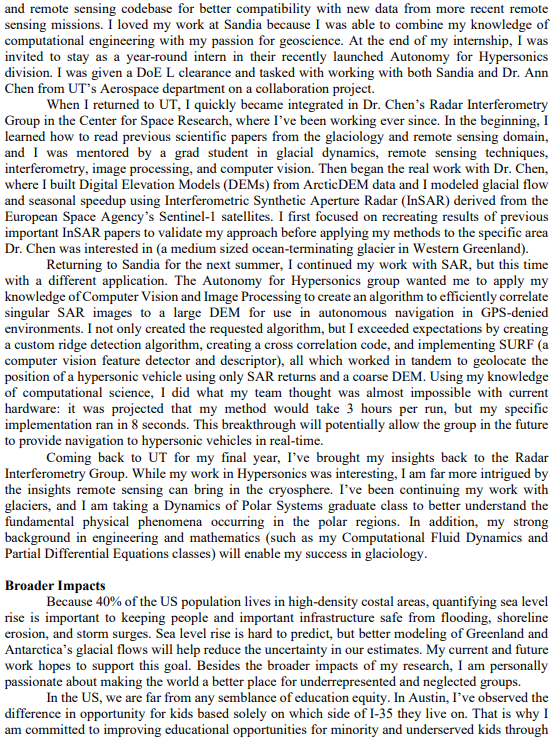

>>>>>  gd2md-html alert: inline image link here (to images/image4.png). Store image on your image server and adjust path/filename/extension if necessary.  (<a href="#">Back to top</a>)(<a href="#gdcalert5">Next alert</a>) >>>>> 

<h1>August-September-October: Asking for Letters of Recommendation, Searching & Reaching Out to Potential Advisers, Starting Applications, and The NSF GRFP Application</h1>

<h2>Asking for Letters of Recommendation</h2>

Letters of recommendation are one of the most important parts of your application. Most programs as well as the NSF GRFP application (which we will get to soon) require 3 letters.

<h3>Who to Ask</h3>

As mentioned earlier in the document, I’ve been told that it’s preferable that your letters be from professors. These letters are supposed to evaluate your potential to succeed in research and graduate school, so it’s important to find people who can speak to your previous work positively. This is another reason why it is so important to start to cultivate good relationships early in your undergraduate career. 

To be more specific, here are some things you may want to look for in a letter writer. Look for someone who:

<ul>

<li>Knows you well, hopefully a little more than just name basis

<li>Is a professor

<li>Has seen your research ability first hand

<li>You’ve worked closely with on a class project (think senior design prof)

<li>Knows your goals

<li>Likes you
</li>
</ul>

Your letter writer doesn’t have to have all of these things! Though you usually need three letters, check your program requirements to make sure you don’t need more. I would recommend choosing four people just in case a letter writer gets flakey on you. 

<h3>When and How to Ask</h3>

Depending on who you ask, different people will give you different answers on when to initially request a letter of recommendation. I would say two months is a good middle ground. If you know your letter writer is particularly busy, perhaps consider giving them more notice. It’s likely that the first deadline will be November 1st if you are going to do the NSF GRFP (we’ll talk about this in the next section), which you definitely should do. So I would recommend asking at the beginning of September. 

I would recommend asking in person, that way you can get a sense of if they’re reluctant to write you a letter. You probably don’t want a letter from someone who is pretty hesitant about it. For me, I sent a quick email to my letter writers asking if I could set up a quick meeting with them to get their advice on some grad school stuff and possibly ask for a letter from them. Here is one of my emails: 

>>>>>  gd2md-html alert: inline image link here (to images/image5.png). Store image on your image server and adjust path/filename/extension if necessary.  (<a href="#">Back to top</a>)(<a href="#gdcalert6">Next alert</a>) >>>>> 

When you talk to them in person, tell them about your goals, interests, and with who or what schools you’re thinking of applying to. Hopefully they can provide some good advice, especially if they work in that field! This is a great opportunity to get some powerful insight, so don’t squander it! At the end of the meeting, you can ask them if they would be willing to write you a letter of recommendation. If they say yes, ask what they need from you. Some will request your CV, your application materials, a rough draft of your statement of purpose, your transcript, etc. Some may even ask that you help write the letter. Once they say yes, I would send a follow up email thanking them for writing you a letter and also attach your CV and other relevant info (I worked on this project with you and accomplished this etc). Let them know when to expect the deadlines. Once you begin the application process on each programs website, you will be sending each letter writer a link via email to upload their letter.

<h2>Searching for Potential Advisers</h2>

Your adviser will probably be the most important person in your graduate career. Your advisor is a faculty member whose role is to guide you through graduate school in both classwork and research. Different advisors will have different areas of expertise and mentoring styles, so it’s important to choose the advisor who will be best for you.

<h3>Where to Start</h3>

Here is some advice I recently gave a friend: Since choosing your advisor is one of the biggest decisions you’ll make in this, it’s important to do your research. I would start by finding a professor that most aligns with what interests you—don’t search a program first and then find a professor in that department. I mean, you can do that, but you might end up compromising on your research subject.

In terms of searching tips, here are a couple of approaches: First, search for research papers in your domain that excite you. Use google scholar and find papers that feel most closely aligned with what you would want to do in the future. Look for the authors of those papers and google them. Look at their personal research or group page to better understand their area of interest. 

Second, (these aren’t mutually exclusive, i think it’s beneficial to do both) is to find a professor at UT that does similar work (doesn’t have to be super close) and ask to meet / zoom with them. Talk about your interests and what you eventually want to do in the future and ask them for advice: who should you talk to at what schools? The truth is academia is kinda closed off, and an insider in your domain is super valuable because they know the nuances of the different areas of research of other professors and the differences between them. Academic papers are super hard to read at first so it’s hard to figure out for yourself what professor most aligns with your interest. This is a good way to find your initial leads and both of these pathways together should land you with a list of professors to pursue as potential advisers. 

<h2>Reaching out to Potential Advisers</h2>

<h3>The Inquiry Email</h3>

This is probably the most important part of the process both because this will likely be your advisor throughout your PhD and also because they largely make the decision to accept you to the program. We really want to knock it out of the park with our first email then and make a good first impression. This is in part why spending time building the CV earlier is super important, now we can show off all our hard work!

First, do your research and check out their group and/or personal webpage. A lot of professors seem to have a section about how to join their lab or research group. If they do discuss how to express interest in working with them, follow those instructions! If not, or if their page instructs you to email them, let’s start working on crafting an inquiry email.

Now is a great time to whip out the CV we made earlier. Make sure it’s in PDF format and attach it to the email. Don’t be dumb like me and forget to attach it because you will look stupid when you say “attatched is my CV” and they reply:

>>>>>  gd2md-html alert: inline image link here (to images/image6.png). Store image on your image server and adjust path/filename/extension if necessary.  (<a href="#">Back to top</a>)(<a href="#gdcalert7">Next alert</a>) >>>>> 

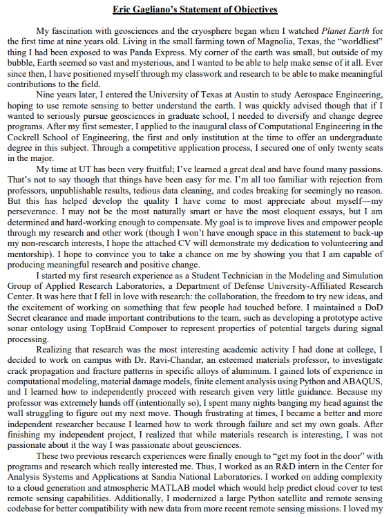

Email time! I’ve been told it’s best to keep these no more than medium length, whatever that means. The goal here is to make your introduction, grab their attention, and hopefully interest them enough to want to continue a conversation. A good strategy is to focus the first paragraph on who you are and your academic background and the second on expressing interest in their work (and also include some detail about their website or a publication of theirs to prove that you did your homework and are interested enough) and then also ask if they will have any openings for the term you are applying for. Here is a template I made and then edited for each professor:

>>>>>  gd2md-html alert: inline image link here (to images/image7.png). Store image on your image server and adjust path/filename/extension if necessary.  (<a href="#">Back to top</a>)(<a href="#gdcalert8">Next alert</a>) >>>>> 

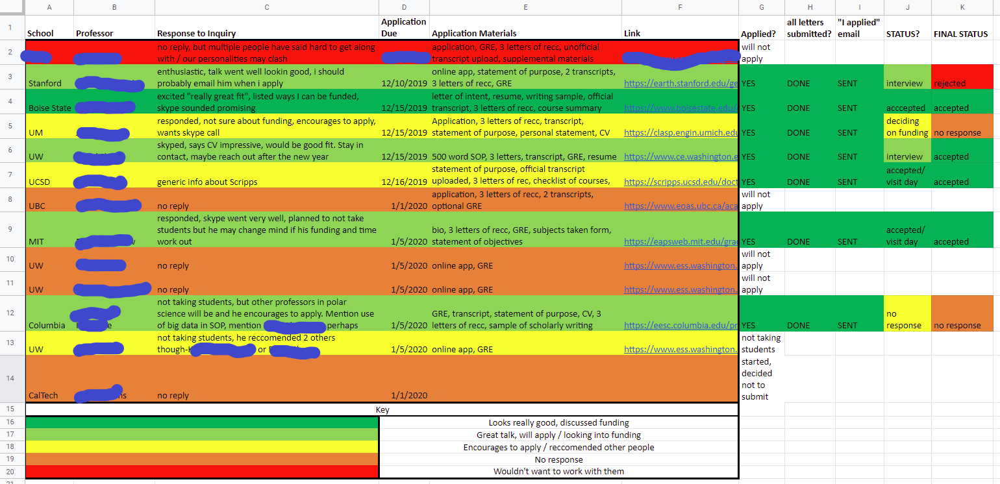

Unfortunately, not everyone will respond. I got lucky because eight out of the thirteen emails I sent out were responded to. I hear it can usually be a lot worse, some friends have told me only a third of their inquiry emails were responded to. It’s also a good idea to keep a spreadsheet of who all you’ve sent an email to and associated information, which you can later turn into an application checklist for each school:

>>>>>  gd2md-html alert: inline image link here (to images/image8.png). Store image on your image server and adjust path/filename/extension if necessary.  (<a href="#">Back to top</a>)(<a href="#gdcalert9">Next alert</a>) >>>>> 

<h3>The Skype/Zoom Call</h3>

	If you’ve received an email back with interest from the potential adviser, they will likely set up a call to chat. This is a great opportunity for them to learn about you, your background and your interests, and a great opportunity to learn about them, their ongoing projects, and their mentorship style / lab expectations. You should go into this call already having a good idea of what they do, but it’s ok to ask about specifics or about details of ongoing projects. I would treat it almost like an interview: you don’t want to not have done your research, because it will look bad when you ask them “so what do you guys do here?”. Additionally, I would have written down some questions that you prepared beforehand to ask them. A<strong>sk genuine questions which you think will help you make your decision. Ask yourself “What is important to me in a program or advisor?”, and form your questions around those. For example, are you very independent and like a more hands-off mentorship style? Ask them what their mentorship style is like!</strong> Some questions that I asked:

>>>>>  gd2md-html alert: inline image link here (to images/image9.png). Store image on your image server and adjust path/filename/extension if necessary.  (<a href="#">Back to top</a>)(<a href="#gdcalert10">Next alert</a>) >>>>> 

	Don’t be too worried about keeping the conversation going, from my experience they seem to take over and steer the conversation. Stay in contact with them if you can! Hopefully they can give you some insight into the program application.

<h2>Starting Applications</h2>

	Now that you have a good idea of some of the schools you will probably be applying to, look further into the application process. Back in the May-June-July section we looked at program requirements and due dates. Let’s take it a step further and start signing up for application accounts and filling out preliminary info. There will probably be a lot of copy and pasting from your CV, as a lot of times they have different fields to fill in for each category of ingo they want. You can now work on application materials as best fits your timeline, so peak ahead a bit for tips on personal statements and such.

<h2>The National Science Foundation Graduate Research Fellowship Program Application (NSF GRFP)</h2>

Though this step is technically optional, I highly highly highly recommend it. Even if you think you have a 0% chance of winning the fellowship, you’re probably underestimating yourself AND even if you don’t win, this is great practice and can even serve as a template for your statement of purpose you’ll need to write anyway for your applications. <strong>ALSO, if you end up getting turned down from a program or professor because they don’t have funding for you and then you end up winning this award, email them and there will be a chance that they will take you on because you come with your own funding!</strong> This is a good way to stay on track with the other deadlines. Seriously, you have nothing to lose. Do it!

<h3>What is the NSF GRFP and Why You Should Apply?</h3>

If you are a U.S. citizen, national, or permanent resident, you can apply for the NSF GRFP. Check out this link for great program information: <a href="https://www.nsf.gov/ehr/Pubs/grfpoutreach2020.pdf">https://www.nsf.gov/ehr/Pubs/grfpoutreach2020.pdf</a> (updated 2020) The TLDR is that this is a competitive fellowship program that will fund 3 years of your PhD if you win (they will pay your tuition and pay you 34,000 a year for 3 years). They usually receive between 12,000-17,000 applications and fund 2,000 of them. So the odds aren’t too bad! Here are the eligible fields of study:

• Chemistry

• Computer & Information Science/Engineering 

• Engineering 

• Geosciences 

• Life Sciences 

• Materials Research 

• Mathematical Sciences 

• Physics and Astronomy 

• Psychology 

• Social Sciences 

• STEM Education

The entire application consists of 5 things: 

<ol>

<li>Personal Info (includes Education, Work/Research Experience, Field of Study, Honors, Awards, Publications)

<li>Personal, Relevant Background and Future Goals Statement (3 pages)

<li>Graduate Research Statement (2 pages)

<li>Transcript

<li>3 Letters of Reference (minimum is 2, but it is highly recommended to have 3)
</li>
</ol>

All things considered….. That’s not a lot. All of the application materials are due the third week of October (the field you apply to will determine which exact day yours is due), and all reference letters are due November 1st. With this application, it is VERY VERY important to follow all instructions exactly, especially formatting. If you do not comply with their format, they will not even look at your application. Watch the GRFP Tutorial here: <a href="https://www.nsfgrfp.org/applicants/grfp_application_tutorial">https://www.nsfgrfp.org/applicants/grfp_application_tutorial</a>

<h3>NSF Merit Review Criteria</h3>

In all of your application materials you will be judged on the two NSF Merit Review Criteria: Intellectual Merit and Broader Impacts. 

Briefly, Intellectual Merit refers to “How important is the proposed activity to advancing knowledge within its own field or across different fields?”. This includes “Demonstrated intellectual ability (grades, curricula, awards, etc.),  Other evidence of your potential, such as ability to: Plan and conduct research, Work as a member of a team as well as independently, Interpret and communicate research, Take initiative, solve problems, persist. The potential of your approach to your field of study and your Research Plan to advance knowledge.”.

>>>>>  gd2md-html alert: inline image link here (to images/image10.png). Store image on your image server and adjust path/filename/extension if necessary.  (<a href="#">Back to top</a>)(<a href="#gdcalert11">Next alert</a>) >>>>> 

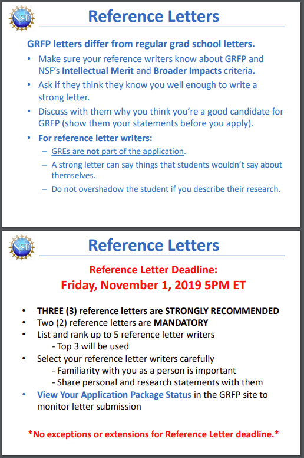

Broader Impacts refers to: “How well does the proposed activity benefit society or advance desired societal outcomes?” More specifically, “Potential impact of the individual (you!) on society, Potential impact of your research on society; why it’s important Societal benefits may include, but are not limited to: Increasing participation of underrepresented groups, women, students with disabilities, veterans, Outreach: Mentoring; improving STEM education in schools, Increasing public scientific literacy; increased public engagement with STEM, Community outreach: science clubs, radio, TV, newspapers, blogs, Potential to impact a diverse, globally competitive workforce, Increasing collaboration between academia, industry, others”.

>>>>>  gd2md-html alert: inline image link here (to images/image11.png). Store image on your image server and adjust path/filename/extension if necessary.  (<a href="#">Back to top</a>)(<a href="#gdcalert12">Next alert</a>) >>>>> 

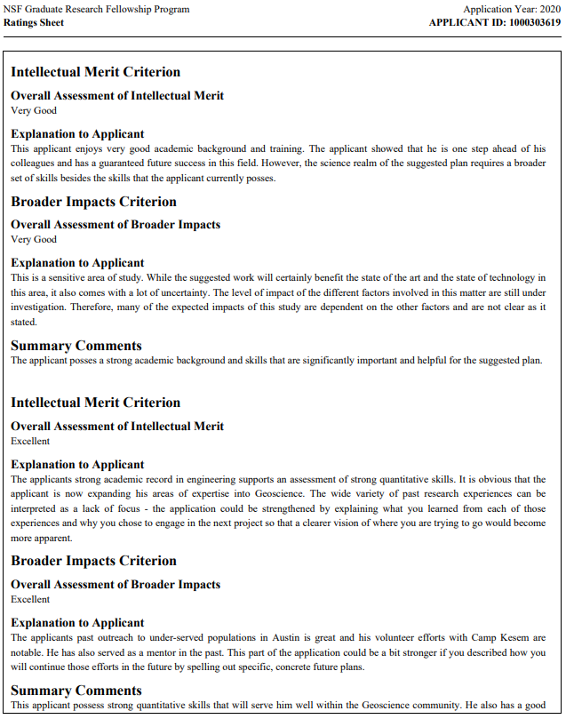

It may be good to look back at your CV and start figuring out which activities fall under what categories. Remember, you will need to address the two criteria everywhere in your application! In fact, it’s recommended to address both criteria in both the Personal Statement and Research Statement into two separate sections.

<h3>Personal, Relevant Background and Future Goals Statement</h3>

	This statement is the bread and butter of your application. This is where you get to tell them your story, background, goals and make the case that you have great potential for STEM research. Here is a summary of what you should talk about:

>>>>>  gd2md-html alert: inline image link here (to images/image12.png). Store image on your image server and adjust path/filename/extension if necessary.  (<a href="#">Back to top</a>)(<a href="#gdcalert13">Next alert</a>) >>>>> 

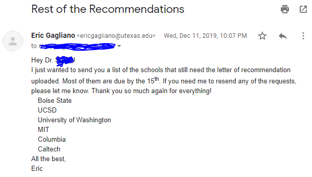

Remember, this slide is just a summary. Look at the actual solicitation for finer details. I was advised to have headings for each portion of the statement which definitely helped me organize my thoughts and also allowed me to better address the Merit Criteria separately. The great part of this statement is it can act as a solid foundation for the personal statements you will write for each school’s application. In fact, my personal statements are largely (>50%) borrowed from this document. Since these statements are similar, if you need some help on this statement, skip ahead to the Personal Statement subsection for more resources. 

Here is my own Statement that I used in my NSF GRFP application:

>>>>>  gd2md-html alert: inline image link here (to images/image13.png). Store image on your image server and adjust path/filename/extension if necessary.  (<a href="#">Back to top</a>)(<a href="#gdcalert14">Next alert</a>) >>>>> 

>>>>>  gd2md-html alert: inline image link here (to images/image14.png). Store image on your image server and adjust path/filename/extension if necessary.  (<a href="#">Back to top</a>)(<a href="#gdcalert15">Next alert</a>) >>>>> 

>>>>>  gd2md-html alert: inline image link here (to images/image15.png). Store image on your image server and adjust path/filename/extension if necessary.  (<a href="#">Back to top</a>)(<a href="#gdcalert16">Next alert</a>) >>>>> 

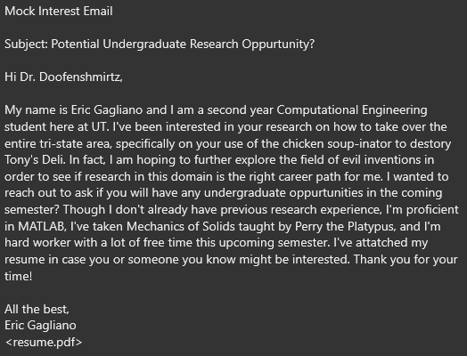

<h3>Graduate Research Statement</h3>

	The Research Statement is a chance for you to propose your own research plan. Basically, choose a research topic and describe how you will tackle it. I was told that this doesn’t necessarily have to be either what you are currently working on or what you want to work on. It does have to align with the area of interest you check on your application though. My FIG mentor and friend Joey Williams gave me the following advice, “The intent behind writing the research plan is to demonstrate that you are able to do a basic literature review, understand the current state of the field, and propose a direction to go in the future. My research plan was written about a project I was working on in undergrad, but I had zero intention of working on it or anything like it in my graduate degree.”. Make sure to include figures using the correct formatting, as it will help fill space if you are intentionally trying to be vague (ooops) and it will help you better describe your research plan. Plus I personally think figures add a bit of “wow” factor. Here is the summary slide on the Research Statement:

>>>>>  gd2md-html alert: inline image link here (to images/image16.png). Store image on your image server and adjust path/filename/extension if necessary.  (<a href="#">Back to top</a>)(<a href="#gdcalert17">Next alert</a>) >>>>> 

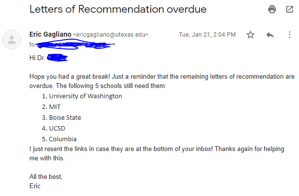

This is arguably the hardest part of the application, especially if you are new to the domain in which you are applying. You really need to know about a field before you start randomly proposing a new direction. If you are currently doing undergraduate research (or did some recently), talk to the professor you work(ed) with and see if you can enlist their help for some guidance on this. I foolishly didn’t, so my Research Statement included some guesswork on my part. I would later find out that some of the research problem I layed out had already in part been tackled… 20ish years ago. Whoops. Had I asked my undergraduate research professor at the time to look over it, she would have surely pointed this out to me. 

Even though in some respects I’m a little ashamed of my Research Statement, I will show it here so you can get a better idea of what to shoot for:

>>>>>  gd2md-html alert: inline image link here (to images/image17.png). Store image on your image server and adjust path/filename/extension if necessary.  (<a href="#">Back to top</a>)(<a href="#gdcalert18">Next alert</a>) >>>>> 

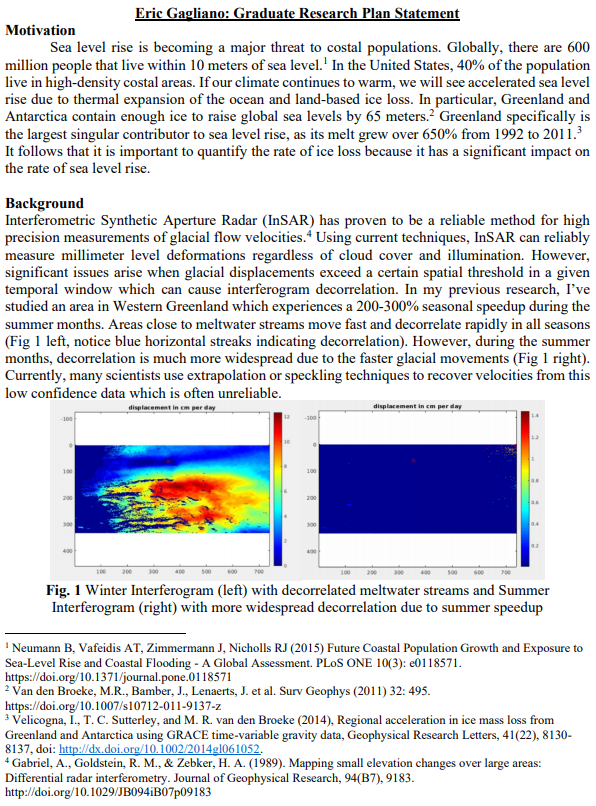

>>>>>  gd2md-html alert: inline image link here (to images/image18.png). Store image on your image server and adjust path/filename/extension if necessary.  (<a href="#">Back to top</a>)(<a href="#gdcalert19">Next alert</a>) >>>>> 

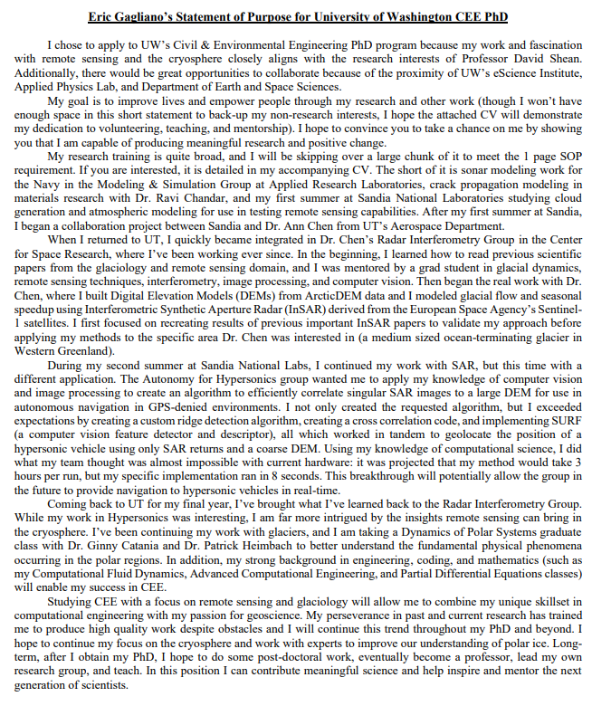

<h3>Reference Letters</h3>

Not a lot is different here, we already went over letters of recommendation a bit. Though I didn’t know this at the time, for this particular application it is recommended (hah!) to have your recommender address the Merit Criteria. Oopsies. But if you give your recommenders enough notice, I feel like this shouldn’t be too hard to do. Remember, these are due November 1st. Here are the summary slides for Reference Letters:

>>>>>  gd2md-html alert: inline image link here (to images/image19.png). Store image on your image server and adjust path/filename/extension if necessary.  (<a href="#">Back to top</a>)(<a href="#gdcalert20">Next alert</a>) >>>>> 

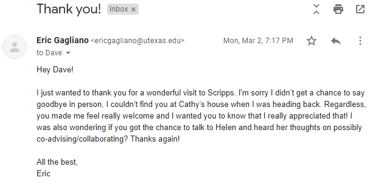

<h3>Feedback</h3>

	It turns out that whether you are awarded the fellowship or not, the reviewers will give you feedback on your application. I ended up getting the fellowship, but honestly my feedback felt like my success wasn’t super warranted. In particular, it seems the reviewers main concerns with me were no publications/presentations (fair point), a lack of focus (because of the wide variety of past experiences), not having the skills needed for my research plan, overconfidence in my proposed research’s broader impacts, and various other little things. Honestly, I felt throughout my application materials I addressed most of these concerns, but at the end of the day they are the experts and they have the final say. I’ve heard that academia can be pretty harsh with criticism, so perhaps I just need to get used to that (honestly, I’m pretty sensitive). 

I’ve attached my feedback here for you to compare with my actual application materials so you can improve your application and anticipate concerns:

>>>>>  gd2md-html alert: inline image link here (to images/image20.png). Store image on your image server and adjust path/filename/extension if necessary.  (<a href="#">Back to top</a>)(<a href="#gdcalert21">Next alert</a>) >>>>> 

>>>>>  gd2md-html alert: inline image link here (to images/image21.png). Store image on your image server and adjust path/filename/extension if necessary.  (<a href="#">Back to top</a>)(<a href="#gdcalert22">Next alert</a>) >>>>> 

<h3>Resources</h3>

Very thorough review of the entire process, as well as example essays and feedback: <a href="http://www.malloryladd.com/nsf-grfp-advice.html">http://www.malloryladd.com/nsf-grfp-advice.html</a>

More GRFP overview, but also large collection of previous winner essays and ratings across various fields:

<a href="https://www.alexhunterlang.com/nsf-fellowship">https://www.alexhunterlang.com/nsf-fellowship</a>

Fellowship opportunities for minorities and women: <a href="https://www.profellow.com/fellowships/26-stem-graduate-fellowships-for-minorities-and-women/">https://www.profellow.com/fellowships/26-stem-graduate-fellowships-for-minorities-and-women/</a>

<h1>November-December: Complete the Applications, Let Potential Advisers Know, Make Sure Letter Writers Submit</h1>

<h2>Complete the Applications</h2>

It’s crunch time now! Let’s finish up these applications.

<h3>Statement of Purpose / Personal Statement / Statement of Objectives</h3>

I won’t have much to say here that hasn’t already been said by everyone else out there, so I will summarize what other people have said and link to additional resources. Check these resources out below!! Just some important things to note: there are <strong>differences</strong> between Statements of Purpose, Personal Statements, Statement of Objectives, and whatever other combination of words they can throw together. This is why it is important to read deeper into the application requirements for each school, as they will usually explain further what needs to be in each statement. Sometimes these phrases will be used interchangeably, and sometimes one school’s SOP could be completely different than another school’s SOP. So just make sure to fully comply with formatting and length requirements as well as address what each school and program ask you to.

Here we will talk about what is generally in these statements. Again, each program will have different requirements so personally I created a master statement and then modified it for each separate program.  In general, things that may be worth addressing:

<ul>

<li>Who are you?

<li>Any unique background / barriers to academics?

<li>What are you interested in?

<li>What is your motivation/why this degree?

<li>What is your relevant experience (research, classes, jobs, internships, projects)?

<li>What did you learn via those experiences / any challenges?

<li>Any scholarly publications?

<li>How does that experience relate to the program you are applying to?

<li>Specific examples that helped you decide your area of study?

<li>Specific examples of problems you might want to address?

<li>Who would you want to work with and why?

<li>Why are you a good fit for this program?

<li>Short and long term career goals?
</li>
</ul>

Here is an example of a SOP prompt for a school I applied to (Scripps Institute of Oceanography @ UCSD):

>>>>>  gd2md-html alert: inline image link here (to images/image22.png). Store image on your image server and adjust path/filename/extension if necessary.  (<a href="#">Back to top</a>)(<a href="#gdcalert23">Next alert</a>) >>>>> 

This prompt in particular is super helpful in building a general “master statement” from which you can tailor to each school.

 To beat a dead horse: each program will have different requirements for a SOP so follow the instructions exactly for each program. These questions, however, are a great starting point. For the programs I applied to, 4 or so of the statements were 90% the same, but a couple of others were different because of different page requirements / essay prompts.

Lastly, some important reminders. Remember to mention your potential advisor in this statement and why you would like to work with them. Remember to tailor each statement to the specific program you are applying to. Remember to proofread your statement repeatedly. Remember to share your statement with friends and professors and ask them to review and proofread it. 

<h3>My Statements</h3>

Here are a couple different statements I used in my application process. Note the variation in page length and content. The first example is a one page SOP for UW, the second example is a two page statement of objectives for MIT, and the third example is a Personal Statement for UM with no mention of academics. This is because they make you submit both a Statement of Purpose and Personal Statement. The latter only speaks to “How have your background and life experiences, including cultural, geographical, financial, educational, or other opportunities or challenges, motivated your decision to pursue a graduate degree at the University of Michigan?”. This separate statement without academics isn’t too uncommon!

>>>>>  gd2md-html alert: inline image link here (to images/image23.png). Store image on your image server and adjust path/filename/extension if necessary.  (<a href="#">Back to top</a>)(<a href="#gdcalert24">Next alert</a>) >>>>> 

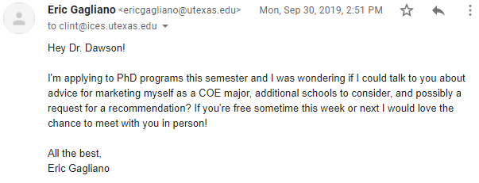

>>>>>  gd2md-html alert: inline image link here (to images/image24.png). Store image on your image server and adjust path/filename/extension if necessary.  (<a href="#">Back to top</a>)(<a href="#gdcalert25">Next alert</a>) >>>>> 

>>>>>  gd2md-html alert: inline image link here (to images/image25.png). Store image on your image server and adjust path/filename/extension if necessary.  (<a href="#">Back to top</a>)(<a href="#gdcalert26">Next alert</a>) >>>>> 

>>>>>  gd2md-html alert: inline image link here (to images/image26.png). Store image on your image server and adjust path/filename/extension if necessary.  (<a href="#">Back to top</a>)(<a href="#gdcalert27">Next alert</a>) >>>>> 

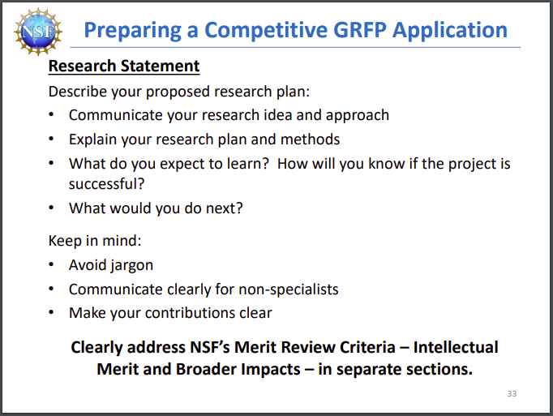

<h3>Resources </h3>

Super helpful SOP Guide Section:

<a href="https://owlcation.com/academia/How-to-Applying-to-STEM-PhD-Programs-US">https://owlcation.com/academia/How-to-Applying-to-STEM-PhD-Programs-US</a>

General difference between a SOP and Personal Statement as well as assorted tips. <a href="https://www.prepscholar.com/gre/blog/statement-of-purpose-vs-personal-statement/">https://www.prepscholar.com/gre/blog/statement-of-purpose-vs-personal-statement/</a>

Great page that shows a possible set of stages for writing the SOP: <a href="https://web.mit.edu/msrp/myMSRP/docs/Statement%20of%20purpose%20guidelines.pdf">https://web.mit.edu/msrp/myMSRP/docs/Statement%20of%20purpose%20guidelines.pdf</a> 

Nice collection of STEM SOPs

<a href="http://statementofpurposeexamples.com/stem/">http://statementofpurposeexamples.com/stem/</a> 

<h2>Let Potential Advisers Know When You Submit</h2>

Staying in contact with your potential advisers is one of the best tips you can get. They, almost single handedly, will eventually decide your fate. When you submit your application, it is important to let them know so they can pull it out of the stack when the time comes to look at applications. A quick email showing your enthusiasm works well, here is an example:

>>>>>  gd2md-html alert: inline image link here (to images/image27.png). Store image on your image server and adjust path/filename/extension if necessary.  (<a href="#">Back to top</a>)(<a href="#gdcalert28">Next alert</a>) >>>>> 

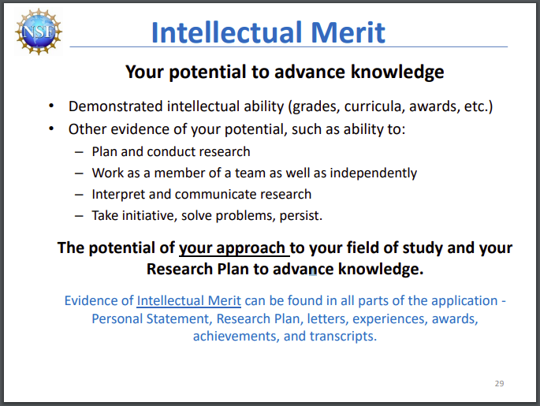

<h2>Make Sure Letter Writers Submit</h2>

Make sure to keep track of which letter writers have and haven’t submitted their letters! A spreadsheet is super useful for this, as sometimes you’ll have a writer miss a link in their email. Use your best judgment when reminding your writers--sending an email everyday may not be appropriate, but maybe a 2 week and 1 week reminder might be useful. Sometimes your letter writer may forget or have other things come up. 

Unfortunately, one of my letter writers did not submit before the deadline and was not responsive to my emails. I’ll show my emails below so you can get an idea of how to gently nudge a letter writer. For this particular person, I ended up having to drop in on their office hours in order to get things moving. By the time they eventually submitted, I had already heard back from most programs.

>>>>>  gd2md-html alert: inline image link here (to images/image28.png). Store image on your image server and adjust path/filename/extension if necessary.  (<a href="#">Back to top</a>)(<a href="#gdcalert29">Next alert</a>) >>>>> 

>>>>>  gd2md-html alert: inline image link here (to images/image29.png). Store image on your image server and adjust path/filename/extension if necessary.  (<a href="#">Back to top</a>)(<a href="#gdcalert30">Next alert</a>) >>>>> 

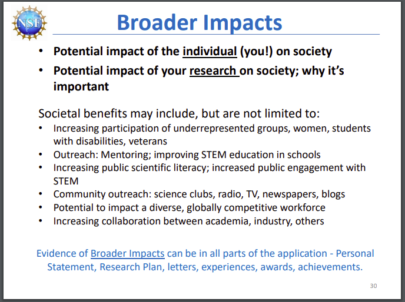

>>>>>  gd2md-html alert: inline image link here (to images/image30.png). Store image on your image server and adjust path/filename/extension if necessary.  (<a href="#">Back to top</a>)(<a href="#gdcalert31">Next alert</a>) >>>>> 

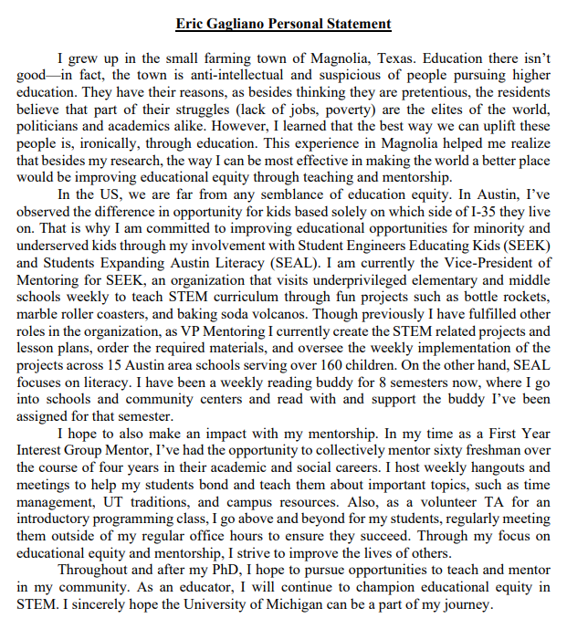

>>>>>  gd2md-html alert: inline image link here (to images/image31.png). Store image on your image server and adjust path/filename/extension if necessary.  (<a href="#">Back to top</a>)(<a href="#gdcalert32">Next alert</a>) >>>>> 

<h1>January-February-March: Application Decisions, Interviews/Visit Days </h1>

If you’ve reached this far, congratulations on submitting your applications! The hard part is over. Try to relax and forget about the applications for now.

<h2>Application Decisions</h2>

In general, I found out most of my decisions in January and one in March. Sometimes you will be directly “accepted” and then have a visit day, and sometimes you will be extended an “interview”. Either way, the program will pay for you to visit in person (actually, who knows with COVID). Each program might do things a little differently. If you are extended an interview, you technically haven’t been accepted! Once your interview is over, you will be contacted afterwards with their decision. I found that out of the seven applications I submitted, for the five that I was most in contact with my potential advisor, I ended up hearing back from, whereas with the two applications I didn’t talk to the potential advisors much I did not receive a decision back. So again, make sure to stay in contact with your potential advisor!

<h2>Interviews/Visit Days</h2>

	If you got an interview or got invited to a visit day, congratulations! Since programs vary widely on this topic, I’ll stick to some broad advice. 

<h3>Interview/Visit Day FAQ</h3>

But first, let’s briefly get some FAQs out of the way. 

<h4>Will my travel be paid for?</h4>

Your travel will be paid for. Sometimes you have to organize the flight yourself, but you will be reimbursed.

<h4>Will I have a schedule?</h4>

You will be given an itinerary and fully planned out schedule that will have tons of mini interviews with various professors and students (even if it’s a visit day, you’ll still have a bunch of “mini-interviews”). 

>>>>>  gd2md-html alert: inline image link here (to images/image32.png). Store image on your image server and adjust path/filename/extension if necessary.  (<a href="#">Back to top</a>)(<a href="#gdcalert33">Next alert</a>) >>>>> 

<h4>Will I have meetings with people? </h4>

You will meet with tons of people, both current and prospective students and faculty. 

<h4>Is there a dress code?</h4>

You will be given a dress code. Usually business casual.

<h4>Will the food be paid for?</h4>

Your food is usually paid for. 

<h4>If it’s an interview, when will I find out the final decision?</h4>

In the case of interviews, they will probably tell you while you are there when you can expect a decision to be made. 

<h4>If it’s an interview, should I come prepared?</h4>

Yes, see the next section for preparation advice.

<h4>Should I try to impress them?</h4>

They will surely try to impress you and get you to come to their school! Try to be yourself if you can, that’s already impressive enough :) 

<h4><strong>*IMPORTANT* What questions should I ask current grad students?</strong></h4>

<em>Revised May 17th, 2022:</em> Two years into my PhD, I’ve learned a whole lot more about the application process and grad school in general. <strong>My biggest piece of advice is to make sure your future relationship with your advisor will be solid. This is essential, and will largely shape your graduate experience.</strong> Therefore, you should try and ask graduate students (ones currently working with your potential advisor) some of these questions:

<ol>

<li>What has been your biggest conflict with your advisor so far, and how did it get resolved?

<li>Are you aware of any of your advisor’s former advisees that have left early or switched advisors? If so, why did they leave? See if they would be willing to speak with you.

<li>Do you think your advisor makes decisions and suggestions that are in your best interest? Even if it doesn’t directly/indirectly benefit your advisor? Do you feel you can pursue your own ideas and collaborate with who you want?

<li>How comfortable are you and other students with freely expressing your views/ideas and/or disagreeing with your advisor? Do you feel like you have to walk on eggshells / manage your advisor’s emotions?

<li>What is your overall satisfaction with your advisor? 

<li>What stage of career is your advisor in / are they tenured? Do you think this affects how they operate / treat you?

<li>What’s the nature of your relationship with your advisor? Do you consider them a supervisor, advisor, or mentor? Do you feel they are too controlling? Do you feel you can share difficult news with them? Do you think you would be comfortable calling them for advice in the future? 

<li>How does your advisor provide feedback?

<li>Do you ever feel disrespected by your advisor? 

<li>Is your advisor receptive to feedback, especially on management / mentorship style? Or is it their way or the highway?

<li>Has anyone ever had their funding threatened (implicitly or explicitly) if they did not do X, Y, Z?

<li>What’s one thing you would change about your relationship with your advisor?

<li>How often do you work late? Do you feel like you always need to be on call?

<li>What does the lab atmosphere feel like in general? Do things ever feel too hierarchical, competitive, or stressful? 
</li>
</ol>

Ideally, you should try to figure out most, if not all of these things. At the very least, please, please, please, try and ask the first question. <strong>Even if you get ~good vibes~ from one/most grad students, you owe it to yourself to be thorough. </strong>You should also ask grad students about other things that are important to you, such as classes, city, friends, culture, health insurance, etc!

<h4>I still have questions about logistics.</h4>

Reach out to the interview or visit day coordinator if you have any questions! 

<h3>Preparation & General Advice</h3>

First, know that this is just as much an interview for you as it is for them. You are deciding on where you will spend the next 5+ years, so you should be evaluating for yourself the program, the people, the academics, the culture, the community, etc. You don’t want to end up somewhere that you won’t be happy. To that end, have some goals in mind for your visit. What do you want to learn and what questions do you want answered? What do you think will be important for your success in grad school? What kind of environment do you want to be in? 

This leads me to my second piece of advice. Using those criteria for what is important to you, create a list of things you care about so you can compare the different programs across different dimensions. I would keep details of all your visit days in some sort of spreadsheet. For instance, some of my columns were: professor, research group members, grad students in the department, research projects, department culture, classes, STEM outreach, stipend, location, cost of living, proximity to friends, etc. It just depends on what is important to you, but in this format it should be easier to compare programs.

Third, come prepared. Know your own research and experience and be able to talk about the details AND the big picture fluently! Know why you are interested in your potential advisor. What kind of work you want to do with them. It doesn’t have to be super specific, but be able to have a conversation about their research with them. So make sure to read through their website and their recent papers and research! Make sure to stay engaged and ask them questions to better understand how the lab operates and how you would fit in. By the time you leave, try to have an understanding of what a project with them would look like for you. Also, try and talk to them about non-academics. Tell them what is important for you, and what you are looking for in a program and in an advisor-advisee relationship.

Fourth, talk to the current students! Usually your schedule will already contain tons of opportunities to talk with them. They are an awesome resource because they will talk candidly about the program and their advisor. That’s why it’s great to talk to your potential advisor’s current students. Find out their mentorship style, their expectations, their helpfulness, etc. Keep note of these things so you can figure out if you and your potential advisor are compatible.

<h3>Afterwords</h3>

After the visit is over, I would email your potential advisor, visit day coordinator, and your student guide (if you were assigned one) and thank them for their hospitality. These visit days and interviews take a lot of planning, and it would be nice to let them know you appreciate them taking time to have you! Also, follow up with your advisor with any out-standing questions you may have, and if you haven’t been accepted, I think it would be pretty classy to mention whatever the outcome, you had a good time and you’re glad you got to know them.

>>>>>  gd2md-html alert: inline image link here (to images/image33.png). Store image on your image server and adjust path/filename/extension if necessary.  (<a href="#">Back to top</a>)(<a href="#gdcalert34">Next alert</a>) >>>>> 

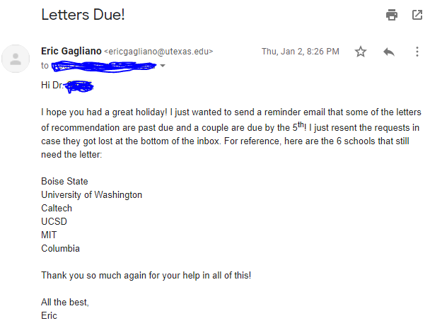

<h1>April: NSF GRFP Results, Making Your Grad School Decision</h1>

<h2>NSF GRFP Results</h2>

	The date you will find out the results of the NSF GRFP tends to vary a bit from year to year. I found out March 30th, but I hear it’s typical for them to announce the first week of April. If you were awarded the GRFP but were rejected from the school you wanted, reach out to them and tell them the news! If the issue was a lack of funding, there is a chance that they will change their minds now that you would be coming in with 3 years of funding. If you weren’t awarded the GRFP, no worries! It’s super competitive anyways. Plus, you can apply again in your first or second year of your PhD. Whether you are awarded the fellowship or not, your feedback sheet should be made available via the online portal a couple of weeks after the announcement. I’ve provided my feedback sheet above in the GRFP section.

<h2>Making Your Grad School Decision</h2>

	All that hard work is about to pay off, time to make your decision! The universal deadline for decisions is April 15th. Whether you got into one school or fifty, it’s time to evaluate offers and weigh your options. For this, you have to go with what feels right for you. I can’t help much here, but recall your visits and think about where you would feel most comfortable, academically and culturally. You might want to reach out to your potential advisors if you still need clarification about anything. When I narrowed down my search to two schools, I created a huge pro / con spreadsheet which was helpful for me. For privacy’s sake I covered up my thoughts, but it looked something that looks like this:

>>>>>  gd2md-html alert: inline image link here (to images/image34.png). Store image on your image server and adjust path/filename/extension if necessary.  (<a href="#">Back to top</a>)(<a href="#gdcalert35">Next alert</a>) >>>>> 

(if you can’t read the criteria on the left they say: Advisor, Research, Program, Group, Collaboration, Friends, Location, Grad Students, Classes, Outreach, Stipend)

Weighing your decision is hard, and there is not much I can help you with at this point, as this choice and the things you value will be different person to person. Like I did above, note the things that are important to you in a choice, and then compare and contrast programs along those categories. It may be helpful to talk your thoughts out loud with a trusted friend or advisor. Feel free to contact me if you want to talk it through!

Also, if you had any mentors or faculty along the way, especially if they are in a similar field to your potential programs, reach out to them and get their advice! In the end though, it’s all you. Personally, I had to wait until the very last couple of days to decide because I was going back and forth between my two options for weeks. I was really lucky because I found those two amazing programs and two amazing potential advisors and two amazing lab groups. I wish I could have gone to both schools! 

	Once you’ve made your decision, make sure to officially accept / decline all your offers, then reach out to your new advisor and tell them the good news! I also think it’s great to reach out to the potential advisors that you declined to thank them for their time, hospitality, and the opportunity to work with them. I also reached out to a couple of the grad students at one of the schools I declined because they were so friendly and helpful and I wanted to thank them!

<h1>Epilogue: Congrats, Thank You Notes, A Personal Note</h1>

<h2>Congratulations!</h2>

	You did it!! I’m so proud of you. If you made it to the end, even if you didn’t get any acceptances, you’ve really accomplished something big just by putting in so much effort to a crazy process.

<h2>Thank You Notes</h2>

	Once everything is over, I would recommend sending out an email to your recommenders/mentors/etc announcing your decision and thanking them, <strong>as well as physical thank you cards</strong> (I know, a little more time consuming but I promise this is a nice touch that will really be appreciated) to all the people who have helped you along the way to thank them and tell them the good news! Here is an example email:

 

>>>>>  gd2md-html alert: inline image link here (to images/image35.png). Store image on your image server and adjust path/filename/extension if necessary.  (<a href="#">Back to top</a>)(<a href="#gdcalert36">Next alert</a>) >>>>> 

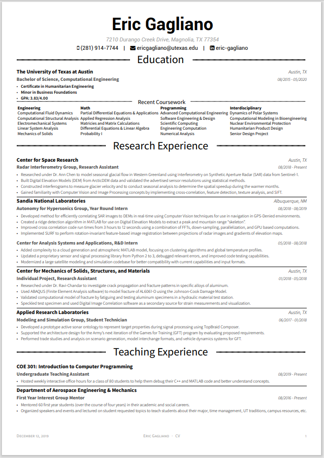

<h2>A Personal Note</h2>

As you’ve seen, this process sucks. If you ever end up in a position of power where you can effect change in the process, strive to make it more transparent and equitable.

<h1>Appendix A: Professor/Program Sheet</h1>

>>>>>  gd2md-html alert: inline image link here (to images/image36.png). Store image on your image server and adjust path/filename/extension if necessary.  (<a href="#">Back to top</a>)(<a href="#gdcalert37">Next alert</a>) >>>>> 

My friend Suhas Raja has made a better template version of this that can be found here: 

<h1>Appendix B: Checklist</h1>

Click here for a handy checklist I made:

<h1>Appendix C: Other Resources</h1>

Great site that walks you through an entire timeline of a school: <a href="https://grad.berkeley.edu/admissions/apply/">https://grad.berkeley.edu/admissions/apply/</a>

<h1>TODO:</h1>

More resources?

Make more profesh 

